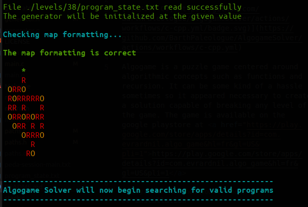

# AlgogameSolver

[](https://github.com/BarthPaleologue/AlgogameSolver/actions/workflows/c-cpp.yml)
[](https://github.com/BarthPaleologue/AlgogameSolver/actions/workflows/codeql.yml)

Algogame is a puzzle game centered around algorithmic concepts such as functions and recursion. It can be some kind of a hassle sometimes so it appeared necessary to create a solution capable of breaking any level of the game. The game is available on the google playstore at <a href="https://play.google.com/store/apps/details?id=com.evrardnil.algo_game&hl=fr&gl=US&pli=1">https://play.google.com/store/apps/details?id=com.evrardnil.algo_game&hl=fr&gl=US&pli=1</a>


## Installation

### Cloning

First you need to clone the repository on your computer.

```sh
git clone https://github.com/BarthPaleologue/AlgogameSolver.git
```

You will need to have installed two other tools to make the solver work.

### GCC

You will need gcc to compile the code for your computer's hardware. There are many tutorials online for you available if you are on Windows. Linux users should already have gcc installed on their machine.

### MAKE

The second tool is Make. As for GCC, there are many tutorials online on how to install Make on your machine so that we can use `make` later.

To test if every thing is working, you can run `make` in the directory of the solver.

The program should compile and start breaking the default level (38).

## Breaking a specific level

We provide a template folder in `./levels`.
You can rename it to the level you want to break and follow the instructions given in the  `./levels/template/level_specifics.c` file.

Once you've adapted the values in the file to your needs, you can run the solver:

```sh
make LEVEL=[name of your folder]
```

You should see the number of tested programs in the console. The solver will run until all the programs have been tested or until you stop it with `Ctrl+c`.

Note that the solver will automatically save its state when you stop it. When you restart it, it will start from where it left off. This is useful if you want to stop the solver for a while and come back to it later.

## More on editing `level_specifics.c`

### Don't forget this

You can copy paste the template folder to `./levels` to break different levels. You can rename it as you want, any folder in `./levels` is treated the same, but you have to respect these two conditions :
- **the variable LEVEL defined in level_specifics has to be set to the name of the folder it is in** <br> Ex : #define LEVEL template

### Reducing the number of tests

Note that can probably provide informations to reduce the number of tests: a successful program might need at least one TURN_RIGHT intruction or one PAINT_RED... In any case it always needs at least one FORWARD. 

You can add constraints in the function `isProgramWorthTesting` in `level_specifics.c`. 

Setting interesting constraint can help speeding up the execution tremendously. But if you don't know how to program in C, no worries in will work fine as is. It will just be longer.


## More on how the solver works

When you have completed all the above steps, you should be able to run the program by entering the command `make` in your terminal in the directory of the solver (or eventually `make LEVEL=template` if you haven't set the LEVEL variable directly in the Makefile). If you followed the instructions, the solver will start brute forcing the level. 

If you made any changes to the code except in the `./levels` folder, you should run `make run-build` instead of `make` to see if the solver passes our tests.

You might have to wait for a few hours depending on the complexity of the level (i.e the number of instructions in the program) and the effectiveness of your constraints.

The program will output all the solutions in the console as you run it. More over, there will be a file called `solutions.txt` in the folder of the level you are breaking. It will contain all the solutions found by the solver.


